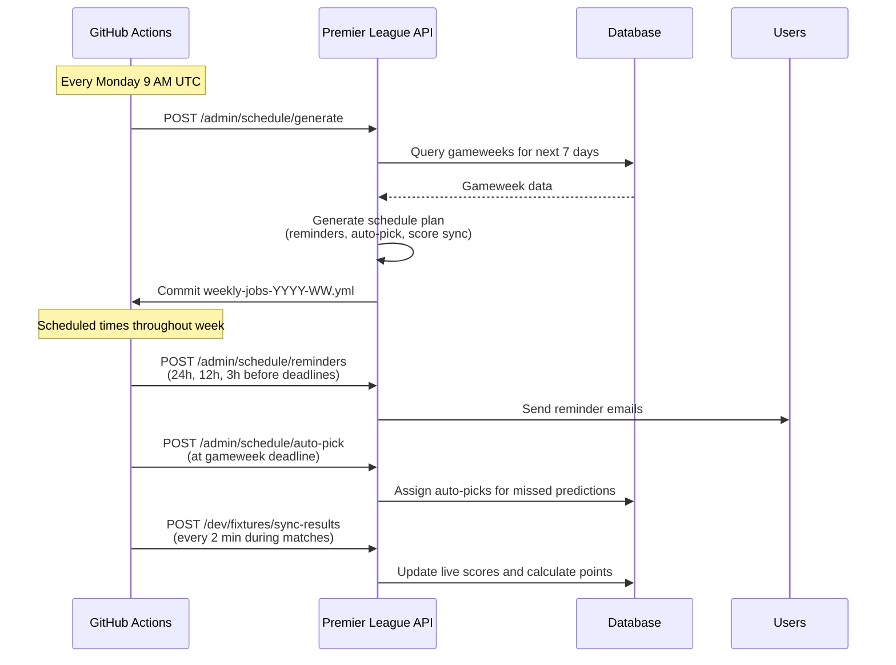

# Premier League platform

A full-stack web application for making weekly Premier League predictions and competing with friends in a fantasy-style prediction league.

## Overview

Premier League Predictions is a competitive prediction game where users select one team to win each gameweek. The application automatically tracks predictions, calculates points based on real match results from the Football-Data.org API, and maintains live league standings with detailed statistics.

## Tech Stack

### Frontend
- **React 18** - Modern component-based UI library
- **TypeScript** - Full type safety
- **Vite** - Fast development and optimized builds
- **TanStack Query (React Query)** - Server state management and caching
- **React Router v6** - Client-side routing
- **Tailwind CSS** - Utility-first styling
- **shadcn/ui** - High-quality component library
- **Vercel** - Frontend hosting (optional)

### Backend
- **.NET 9.0** - Modern ASP.NET Core Web API
- **Clean Architecture** - Separated Core, Application, Infrastructure, and API layers
- **Entity Framework Core** - Code-first database migrations and ORM
- **PostgreSQL** - Production-grade relational database
- **JWT Authentication** - Secure token-based authentication
- **Google OAuth** - Single sign-on integration
- **Repository Pattern** - Unit of Work for clean data access
- **football-data.org API** - Live Premier League fixture and result data
- **GitHub Actions** - Dynamic cron job scheduling for reminders and score sync
- **Render** - API hosting (Docker)
- **Supabase** - Database hosting (PostgreSQL)

## Game Rules

### Predictions
- Each gameweek, select **one** Premier League team to win their match
- Predictions must be submitted before the gameweek deadline
- You cannot change your prediction after the deadline passes

### Scoring
Points are awarded based on your selected team's match result:
- **Win**: 3 points + goals scored and conceded tracked
- **Draw**: 1 point + goals scored and conceded tracked
- **Loss**: 0 points + goals scored and conceded tracked

### League Standings
Users are ranked by:
1. **Total Points** (primary)
2. **Goal Difference** (tiebreaker)
3. **Goals For** (second tiebreaker)

Statistics tracked:
- Wins, Draws, Losses (W-D-L record)
- Goals For, Goals Against, Goal Difference
- Total Picks Made (only completed gameweeks count)

## Features

### Core Functionality
- **Google OAuth Authentication** - Secure single sign-on with Google
- **Personal Dashboard** - View your picks, upcoming fixtures, and performance statistics
- **Weekly Predictions** - Select one team to win per gameweek
- **Automatic Scoring** - Points calculated automatically from live match results
- **League Standings** - Real-time rankings with points, W-D-L records, and goal statistics
- **Fixtures View** - Color-coded display of all matches showing picked teams
- **Responsive Design** - Full mobile support with light/dark theme toggle

### Admin Features
- **Season Management** - Sync teams and fixtures from Football-Data.org API
- **Gameweek Creation** - Automatically create gameweeks from fixture data
- **Backfill Picks** - Enter historical picks for past gameweeks
- **User Management** - View and manage league participants

### Automated Task Scheduling

The application uses a **dynamic GitHub Actions scheduler** instead of traditional background services. This provides:
- **Resource efficiency** - Jobs only run when needed (no 24/7 polling)
- **Reliability** - Survives app downtime and restarts
- **Precision** - Exact cron timing for reminders and score updates
- **Visibility** - All scheduled jobs visible in GitHub Actions tab
- **Cost-effective** - Uses ~45 minutes/month of GitHub's 2,000 free minutes

#### How It Works

#### Scheduled Jobs
- **Reminders**: Sent 24h, 12h, and 3h before each gameweek deadline
- **Auto-Pick**: Assigns random teams to users who missed the deadline
- **Live Score Sync**: Updates scores every 2 minutes during match windows (grouped by 15-minute kickoff intervals)

All schedules are generated dynamically based on actual fixture dates from Football-Data.org.

### Prerequisites

- .NET 9.0 SDK
- Node.js 18+
- PostgreSQL 14+
- Google OAuth Client ID ([Get one here](https://console.cloud.google.com/))
- Football-Data.org API Key ([Get one here](https://www.football-data.org/))
